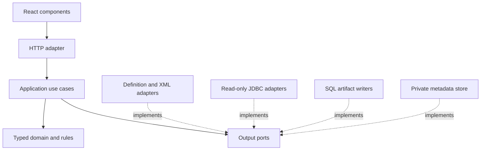

# Architecture

A modular monolith uses ports and adapters. One OCI image serves the React
assets and Java API; a framework-free core owns semantics and decisions.

Arrows are compile-time dependencies; runtime adapters are injected by the
server composition root. Domain/application code imports no Spring, JDBC,
HTTP, parser, filesystem or UI classes. Core tests run without a server/DB.

The source/image contains generic engine capabilities and independently invented
mock fixtures only. Actual database locators, application definitions and models
are external runtime declarations. Do not hard-code a real model into adapters,
UI components or assets. Private workspace revision storage is a product feature;
creating or managing a separate configuration versioning repo/sync is out of scope.

| Boundary | Owns | Must not own |
| --- | --- | --- |
| domain | Logical identities, graph constraints, value states, revision binding, deterministic change semantics | JDBC row locators, XPath execution, DTO serialization |
| application | Inspect/import/compose/map/bind/validate/export/readback orchestration; resource budgets | Concrete SQL, credentials in durable jobs, UI state |
| XML/definition adapter | Hardened parsing, supported meta-schema, qualified selectors, source spans, lossless patches | Guessing application meaning or executing uploaded code |
| DB read adapter | Engine/storage capabilities, consistent observation, transient authenticated connection lifecycle | DML or repair connections |
| SQL writer | Complete guarded package for a qualified client, or typed refusal | A database connection or authority to skip checks |
| storage adapter | Immutable revisions and allowlisted metadata, principal ownership | Raw CLOBs, connection credentials, application secrets |
| React | Component state, accessible forms, projections of authoritative results | Duplicate domain rules or export authorization |

The initial `core` module contains two small reference mechanisms: evidence
readiness and dependency closure. They are **not** the full planner. No public
`ValidatedPlan` constructor should be added later: only the application's
validation orchestration may create that capability after checking complete
bound evidence. HTTP DTOs cannot supply their own PASS records to gain export.

Use narrow interfaces where a real boundary exists: ObservationReader,
DefinitionCompiler, XmlProjection, XmlPatcher, ArtifactWriter, RevisionStore,
AuditSink and Clock. Return immutable data or explicit refusal; close resources
inside the adapter. Avoid a generic plugin framework, event bus, graph database
or solver until a concrete problem justifies one.

## SOLID in this product

Single responsibility separates graph decisions from XML syntax and SQL client
rules. Open/closed means a new DB adapter satisfies conformance tests without
rewriting the core. Liskov requires the same refusal semantics, fidelity and
operation contracts across adapters; partial emulation violates the contract.
Interface segregation keeps writers unable to execute or read a DB. Dependency
inversion makes application-owned ports depend on domain types.

## Deployment boundary

Single-replica hosting is the initial deployment target. Metadata belongs to an
operator/principal, with a versioned persistence contract. Raw observations,
credentials and secret values remain bounded session memory. Restart requires
fresh observation and re-entry. A shared hosted service must prove ownership,
expiry, OIDC/session/CSRF controls and per-user isolation before accepting a DB
credential. The image defaults to demo and supports explicitly configured hosted
authentication. Database inspection/export remain disabled; see deploy/README.md.
